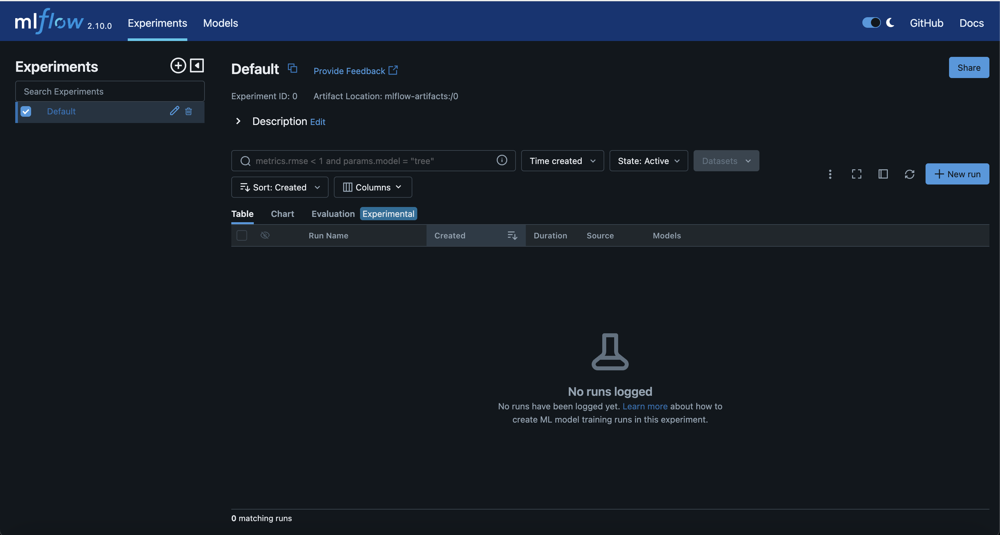
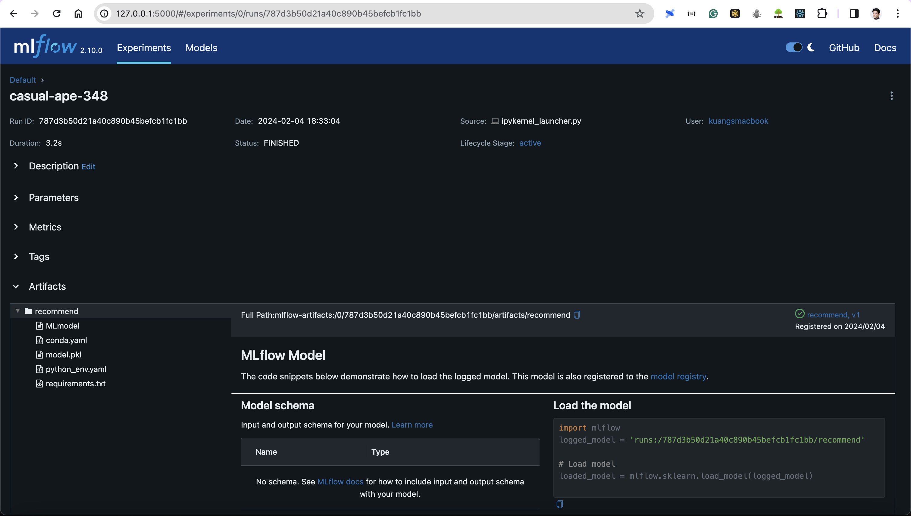
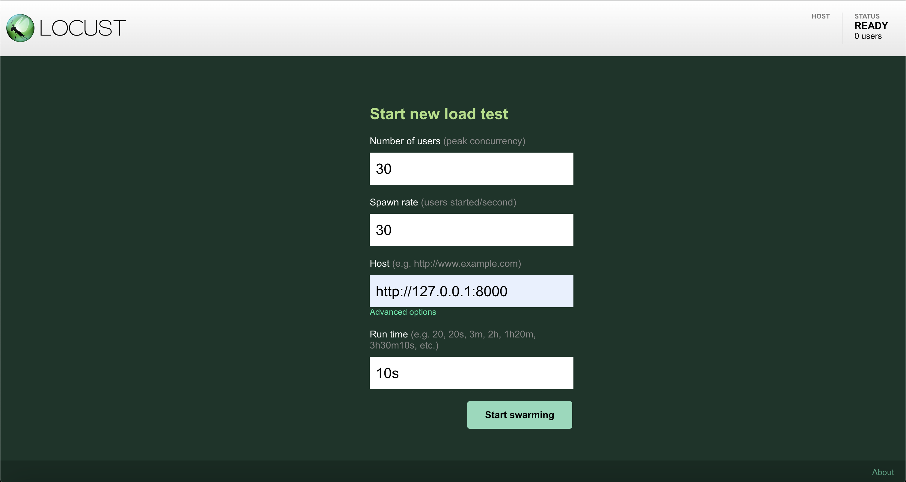
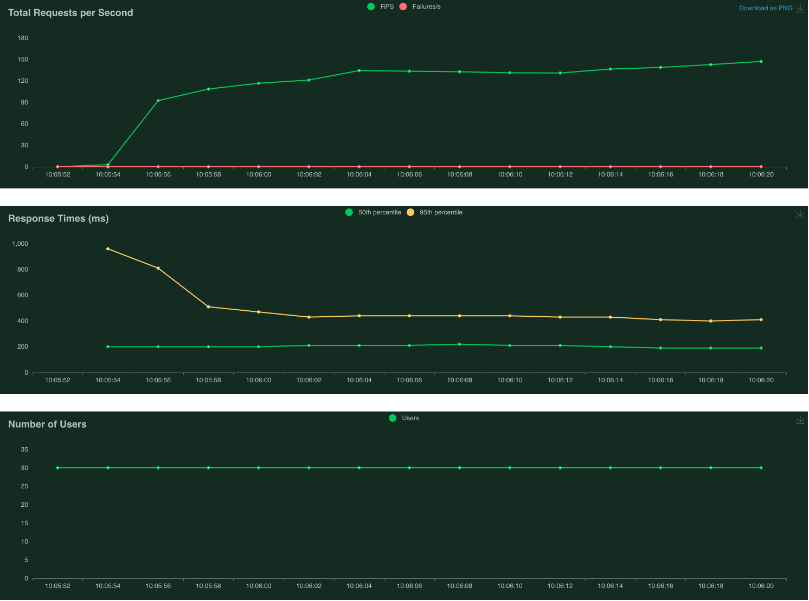

# Restaurant Recommendation

## Description

This is a simple web server that recommends restaurants based on user location with some configurations. The user can input their location and the server will return a list of restaurants that are within a certain distance (meter) from the user.

*built with:*

- `Python` as main programming language
- `FastAPI` as an REST server framework
- `Postgres` Database as user_features and restaurants, and collecting responses
- `MLflow` for model serving

# Usage of the REST APIs

### Route Structure

`/recommend/<str:user_id>?latitude=<float:latitude>&longitude=<float:longitude>&size=<float or int :size>&sort_dis=<float or int :sort_dis>&max_dis=<float or int :max_dis>`

- `user_id`: str - required: is the unique ID of user
- `latitude`: float - required: is the latitude coordinates that the user is located
- `longitude`: float - required: is the longitude coordinates that the user is located
- `size`: float or int - optional: is the number of restaurant objects to be recommended. default is `20`
- `sort_dis`: float or int - optional: is the number as boolean as preference of ascending sorting. default is `1`
- `max_dis`: float or int - optional: is the number of max geodesic or great circle displacement in meters between the user and restaurants. Restaurants further than this are considered irrelevant. default is `5000`

### Example Use

**Route**: `/recommend/u01130?latitude=14.068817&longitude=100.646536&size=50&sort_dis=0&max_dis=5000`

**Method**: `GET`

**Body**: `null`

**Response**:
```json
{
    "restaurants": [
        {
            "id": "r7177",
            "difference": 24.5,
            "displacement": 3378
        },
        {
            "id": "r2528",
            "difference": 24.5,
            "displacement": 2738
        },
        {
            "id": "r1617",
            "difference": 24.6,
            "displacement": 4890
        },
        {
            "id": "r4012",
            "difference": 24.8,
            "displacement": 1616
        }
    ]
}
```
#### Explanation of the response
- `restaurants`: list of restaurant objects
    - `id`: str - is the unique ID of the restaurant
    - `difference`: float - is the euclidean difference of user features and restaurant features
    - `displacement`: int - is the geodesic or great circle displacement in meters between the user and the restaurant
---
<br/>

# Installation
The following are the steps to install and run the server in your local machine as **development environment**.

> *You don't have to do all steps if you use some remote database and MLflow service, or in production.*

## Running the server without using Docker
**Overview of the steps**
1. Clone the repository
2. Create a virtual environment with conda (or your preferred tool)
3. Prepare you Postgres database
4. Install MLFlow
5. Run the MLFlow server with UI (if you have remote MLFlow server, you can skip this step)
6. Install the dependencies
7. Register the model to MLFlow registry (if you have remote MLFlow server, you can skip this step)
8. Load mock-up data to the database (if you have remote database, you can skip this step)
9. Set the environment variables
10. Run the server (with uvicorn)

#### 1. Clone the repository
```bash
git clone <repository-url>
cd <repository-name>
```

#### 2. Create a virtual environment with conda (or your preferred tool)
```bash
conda create -n <env-name> python=3.11.5
conda activate <env-name>
```

#### 3. Prepare you Postgres database
- Create a new database
- Create a new user with password
- Grant all privileges to the user on the database

#### 4. Install MLFlow
```bash
pip install 'mlflow[extras]'
```

#### 5. Now, run the MLFlow server with UI (if you have remote MLFlow server, you can skip this step)
> We use MLFlow to serve the model. `-w 8` is the number of workers.
```bash
mlflow ui --backend-store-uri file://<path-to-mlflow-artifact> -w 8
```
Now, the MLFlow server is running at `http://127.0.0.1:5000`. It looks like this:



#### 6. Install the dependencies
```bash
pip install -r requirements.txt
```

#### 7. Before running the server, we need to register the model to MLFlow registry (if you have remote MLFlow server, you can skip this step, just use the *model URI and run ID*)
*Before running this script, you will need to place `model.pkl` to the same directory as the script.*
```bash
python ml_model/register_model.py
```
This script will register the model to MLFlow registry and return the run ID. You can use this information to set the environment variables. This is where you can find the model run ID:



#### 8. Load mock-up data to the database (if you have remote database, you can skip this step)
For folder `mockup_data`, you have to copy `user.parquet` and `restaurant.parquet` into the folder. The script will copy data to the database.
```bash
# for user features
python parq_to_postgres.py user.parquet --host <host> --port <port> --user <user> --dbname <database_name> --table user_features

# for restaurants
python parq_to_postgres.py restaurant.parquet --host <host> --port <port> --user <user> --dbname <database_name> --table restaurants
```

#### 9. Set the environment variables
```bash
#.env
DATABASE_URL=postgresql+asyncpg://<username>:<password>@<host>:<port>/<database>
MLFLOW_URI=http://<host>:<port> # URI of running MLFlow server
MLFLOW_ARTIFACT_PATH=runs://<run_id>/recommend
ENV=dev # or prod
```

#### 10. Run the server
```bash
uvicorn app.main:app --workers 4
```

#### 11. Now, the server is running at `http://127.0.0.1:8000`. You can use the REST APIs as described above.
> Health check is also available at `http://127.0.0.1:8000/healthcheck`.

## Running the server using Docker

**Overview of the steps**
1. Clone the repository
2. Install Docker
3. Build the image with docker-compose
4. Run the server

#### 1. Clone the repository
```bash
git clone <repository-url>
cd <repository-name>
```

#### 2. Install Docker
Visit this site to download and install Docker Desktop: [Docker Desktop](https://www.docker.com/products/docker-desktop)

#### 3. Build the image with docker-compose
```bash
docker-compose up
```

#### 4. Now, the server is running
> The server is running at `http://localhost:8000`. You can use the REST APIs as described above.

> MLFlow server is running at `http://localhost:4545`.

> Postgres database is running at `http://localhost:5432`.

You can use similar steps to load mock-up data to the database and register the model to MLFlow registry as described in the previous section.

## Run the tests
In this project, we test output of the API with fastapi test client, and Load Test with Locust. The tests are located in `tests` folder. You can run the tests with the following command:

#### 1. Run the API tests
```bash
python -m tests.api_tests.test
```

#### 2. Run the Load Test
```bash
# Install Locust
pip install locust

# Run the Load Test tool
locust -f tests/perf_tests/perf_test.py
```
Now, the Load Test tool is running at `http://0.0.0.0:8089`. <br/>
The UI looks like this:
[](./resources/locust_ui.png)
- You can set the number of users and spawn rate to test the server.

## Load Test Result
**Objective**: <br/>
The server must be able to serve 30 requests per second of the given request parameters with the 90th percentile of response time within 100 milliseconds.

<br/>

**Approach**: <br/>
To achieve the objective, my design of the server is to use FastAPI as the REST server framework, use Postgres as the database, and use MLFlow to serve the model.
- Set up and allow Postgres Database Query requests to be asynchronous.
- Use MLFlow to serve the model with the REST API with 8 workers.
- Use FastAPI to serve the REST API with 4 workers.
- Use numpy and pythonic style coding to optimize the recommendation algorithm.

<br/>

**Result**: <br/>
The server is somewhat able to serve 30 requests per second of the given request parameters with the 90th percentile of response time within 100 milliseconds. However, the 90th percentile in some request parameters is higher than 100 milliseconds. These are the conclusion of the load test:

| Number of users concurrency | Spawn rate (users/second) | Run time (s) | Total Numbers of Requests | Average 90%ile Response Time (ms) | # of Req that 90%ile Response Time < 100ms | % Ratio of Req that 90%ile Response Time < 100ms Per Total |
| --- | --- | --- | --- | --- | --- | --- |
| 30 | 30 | 30 | 796 | 97.41 | 638 | 80.15% |

<br/>

**Rate limiting steps**: <br/>
As I have observed through the inference steps inside the code for *a request*, the result shows that:

- Time to complete request: 0.03885388374328613 seconds
- Finished Get User Features Use 13.066609394655293% of total time
- Finished Aggregate User Features Use 10.384438376338476% of total time
- Finished Get Recommendations Use 46.97879912864725% of total time
- Finished Pad Indices Use 0.08468075967232228% of total time
- Finished Calculate Displacement Use 11.803147915196515% of total time
- Finished Insert Request Params Use 0.24729236339091215% of total time
- Finished Insert Prediction Artifacts Use 0.1362255699076489% of total time

After using asynchronous request to Postgres, it helps to reduce the time of `Get User Features`, `Aggregate User Features`, `Insert Request Params`, and `Insert Prediction Artifacts`.

The most time-consuming step is `Get Recommendations` which uses 46.98% of total time. This step is the inference of model. This is the step that we can optimize further.


*Plot of the 50th and 95th percentile of response time*:
<br/>



For, interactive report and statistics, you can download the files below: <br/>
Download the report [here](./resources/load_test_report.html). <br/>
Download the statistics [here](./resources/load_test_stats.xlsx).

## Discussion

Due to the time constraint, optimization of the server is not fully achieved. The server is somewhat able to serve 30 requests per second of the given request parameters with the 90th percentile of response time within 100 milliseconds. However, the 90th percentile in some request parameters is higher than 100 milliseconds. 

<br/>
These are possible techniques to optimize the server:

-  Run MLFlow server with more workers and distributed in multiple container instances. Manage the MLFlow server with Kubernetes. Attaching Load Balancer to distribute the requests to multiple MLFlow server instances.
However, in present, we don't have to worry about managing the MLFlow server because there are data platform providers out there that provide "Managed MLFlow" services, Databricks is one of them.

-  Use FastAPI with more workers and distributed in multiple container instances. Manage the FastAPI server with Kubernetes. Attaching Load Balancer to distribute the requests to multiple FastAPI server instances. Also, we can take less care of the server by using container management solutions, such as AWS Fargate, Google Cloud Run, or Azure Container Instances. These solutions will let us easily deploy and manage the server without worrying about the infrastructure.

- We can also use native serverless solutions provided by cloud providers, such as AWS Lambda, Google Cloud Functions, or Azure Functions. We can deploy server with cost optimization and auto-scaling. One concern is that, the serverless solutions may not be suitable for long-running tasks, such as the inference of the model.

*Note that* by initializing the server with more workers and distributed in multiple container instances, pricing and cost of running the server will be higher. We have to consider the trade-off between the cost and the performance. One way to optimize the cost is to set up scaling rules to scale the server up and down based on the numbers of load.

## Conclusion

The server is somewhat able to serve 30 requests per second of the given request parameters with the 90th percentile of response time within 100 milliseconds. However, the 90th percentile in some request parameters is higher than 100 milliseconds. The server can be optimized further by using Kubernetes to manage the server and monitor the server's health. We can also use Kubernetes to scale the server up and down based on the load. We have to consider the trade-off between the cost and the performance. One way to optimize the cost is to set up scaling rules to scale the server up and down based on the numbers of load.

---
<br/>

## Author
**Tharathip Kulchotirat** - *Contact* - [LinkedIn](https://www.linkedin.com/in/tharathip-kulchotirat-3b83791a7/ "LinkedIn")